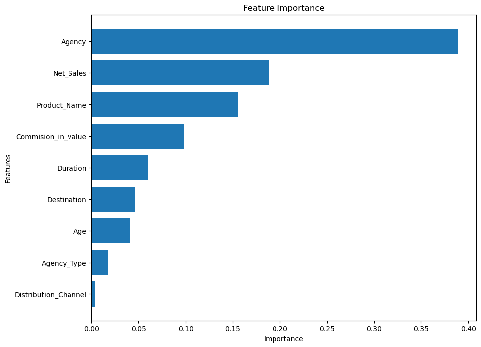
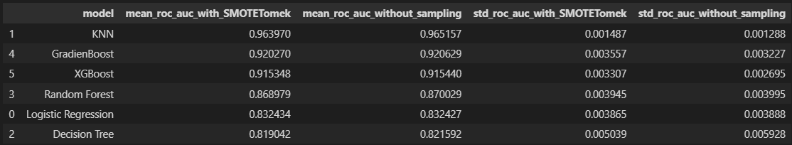

# Travel Insurance Prediction

## Overview

This project aims to predict whether a customer is likely to claim travel insurance using machine learning techniques. By analyzing customer profiles and trip information, the model provides insights into which factors contribute to insurance claims and enables insurance providers to better assess risk and improve customer targeting.

## Table of Contents

- [Overview](#overview)
- [Objective](#objective)
- [Installation](#installation)
- [Dataset](#dataset)
- [Methodology](#methodology)
  - [Data Preprocessing](#data-preprocessing)
  - [Feature Selection](#feature-selection)
  - [Model Building](#model-building)
  - [Model Evaluation](#model-evaluation)
- [Results and Insights](#results-and-insights)
- [Future Improvements](#future-improvements)
- [Visualizations](#visualizations)
- [Contributing](#contributing)

## Objective

The main objective of this project is to develop a model that can predict the likelihood of a customer filing a travel insurance claim based on various factors such as:
- Demographics (age, gender, income level, etc.)
- Trip details (destination, duration, trip type, etc.)
- Customer behavior (previous claims, frequency of trips, etc.)

By identifying key predictors of insurance claims, the model helps insurance companies optimize their policies, reduce risk, and offer personalized insurance products.

## Installation

To run this project on your local machine, follow these steps:

1. **Clone the repository**:
   ```bash
   git clone https://github.com/cahayatambunan/Travel_Insurance_Prediction.git
   ```
   
2. **Navigate to the project directory**:
   ```bash
   cd Travel_Insurance_Prediction
   ```
   
3. **Install the required libraries**:
   Run the following command to install the necessary Python packages:
   ```bash
   pip install -r requirements.txt
   ```

4. **Run the Jupyter Notebook**:
   If you are using Jupyter, execute the following command:
   ```bash
   jupyter notebook Travel_Insurance_Prediction.ipynb
   ```

   Alternatively, you can run the Python script:
   ```bash
   python predict_travel_insurance.py
   ```

## Dataset

The dataset used in this project contains the following features:
- **Customer information**: Age, Gender, Annual Income, etc.
- **Trip information**: Destination, Trip Duration, Mode of Travel, etc.
- **Insurance claim information**: Previous claims, Claim status for current trip, etc.

### Source of Dataset

The dataset used in this project is publicly available from [Kaggle's Travel Insurance Dataset](https://www.kaggle.com/datasets/mhdzahier/travel-insurance).

## Methodology

### 1. Data Preprocessing
- Handle missing values by imputing appropriate values.
- Normalize and scale numerical features (e.g., age, income).
- Encode categorical variables (e.g., gender, destination) using techniques such as one-hot encoding or label encoding.

### 2. Feature Selection
- Exploratory Data Analysis (EDA) to understand correlations and identify key features.
- Use techniques such as Recursive Feature Elimination (RFE) or Lasso to select the most important predictors for the model.

### 3. Model Building
- Train multiple models including:
  - Logistic Regression
  - Random Forest
  - XGBoost
  - Support Vector Machines (SVM)
- Use cross-validation to avoid overfitting and ensure generalization.

### 4. Model Evaluation
- Evaluate the performance of each model using metrics such as:
  - **Accuracy**: Proportion of correct predictions.
  - **Precision and Recall**: For claim vs. non-claim predictions.
  - **F1-Score**: Balancing precision and recall.
  - **ROC-AUC Score**: Measuring the model’s ability to distinguish between classes.

## Results and Insights

- **Key Predictors**: Identified the most influential features contributing to insurance claims (e.g., trip duration, previous claim history).
- **Best Performing Model**: Random Forest achieved the highest accuracy and AUC score among the models tested.
- **Business Impact**: Insurance companies can now predict the likelihood of claims with increased accuracy, enabling better risk management and personalized offerings.


## Future Improvements

- **Hyperparameter Tuning**: Further optimize the models using grid search or randomized search to enhance performance.
- **Incorporate Additional Data**: Including more demographic data or detailed travel history could improve prediction accuracy.
- **Implement in Production**: Develop an API or web app where users can input data to get real-time predictions.

## Visualizations

Here are some visualizations from the analysis:

### 1. Feature Importance
A chart showcasing the importance of various features in predicting insurance claims.



### 2. Model Performance Comparison
A comparison of different models based on evaluation metrics (accuracy, precision, recall, F1-score, etc.).



## Contributing

We welcome contributions to enhance the Travel Insurance Prediction project!

### How to Contribute
1. Fork the repository.
2. Clone your fork to your local machine.
3. Create a new branch for your changes.
4. Make your changes and ensure that they are well-tested.
5. Commit your changes with descriptive messages.
6. Push the branch to your fork and open a Pull Request.
